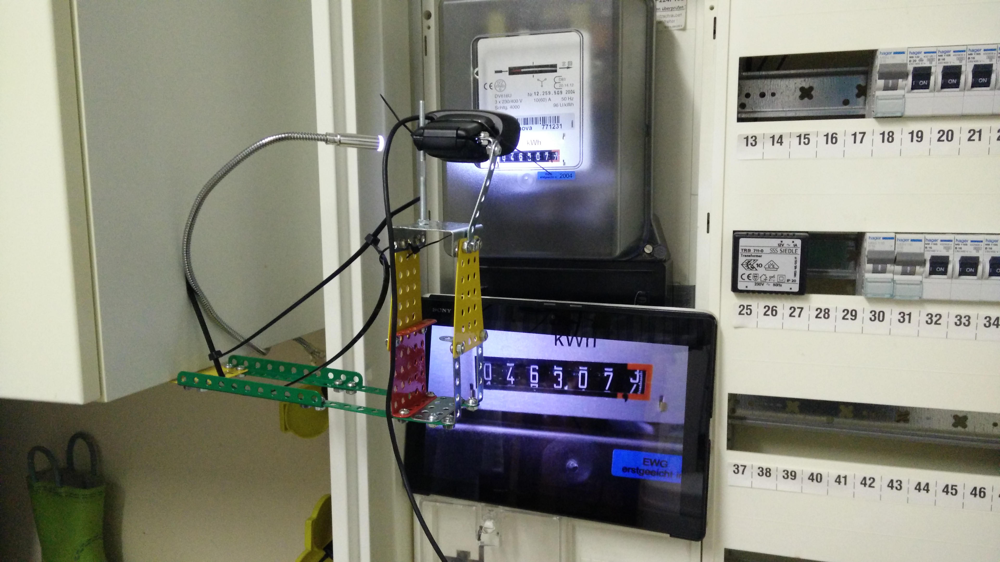

# energy-monitor
Energy Monitor based on Raspberry Pi with a web-cam.

Original idea:
 https://www.mkompf.com/cplus/emeocv.html

Enabling web-cam streaming:
 https://pimylifeup.com/raspberry-pi-webcam-server/

## Hardware

## Software

